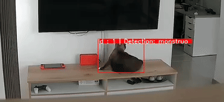

# Cat Detection using Zero Shot Object Detection

Want to keep track of your cats when you're not at home? This repo demonstrates how to perform cat detection using [YOLO-World](https://docs.ultralytics.com/models/yolo-world/) as a zero-shot object detector, along with a color-based classifier using K-means clustering and OpenCV.

<br>
<p align="center">
  
</p>

<br>

- In this approach, the object detector is responsible for detecting the cat. Then, a classifier predicts the cat label by finding the most similar color among the clusters identified in the image.
- This approach requires manually inspecting the pixels of several images and calculating the average RGB values expected for a particular cat. For example, white cats should have a color center close to [160, 160, 160], while black cats should have a color center near [5, 5, 5].
- For inference, a center crop is applied, focusing on the central 70% of the image (this avoids adding noise to the clusters)

# Setup

- Using uv `pip install uv` and then `uv sync`

- Set up a .env file with your CameraConfig (see `src/config.py`). An example .env file for using an RTSP camera can be found in `env.example`.

- Use a SQL lite to store results. The database name and table used for logging will be controlled by env vars SQL_LITE_DB_NAME and SQL_LITE_TABLE_NAME, respectively.

```bash
uv run --env-file=.env src/database.py
```

**Note:**
For this to log detections you must set the arg 'save_to_db' to True in src/detector.py

- Running object detector + classifier

```bash
uv run --env-file=.env src/detector.py
```

- Test classifier on image crops:

```bash
uv run --env-file=.env src/classifier.py
```

# Limitations

- Using color clusters will not work at night, training a classifier for this is suggested for 24/7 usage.
- Multicolor cats might need two color centers, there is an approach suggested in `src/classifier.py`.
